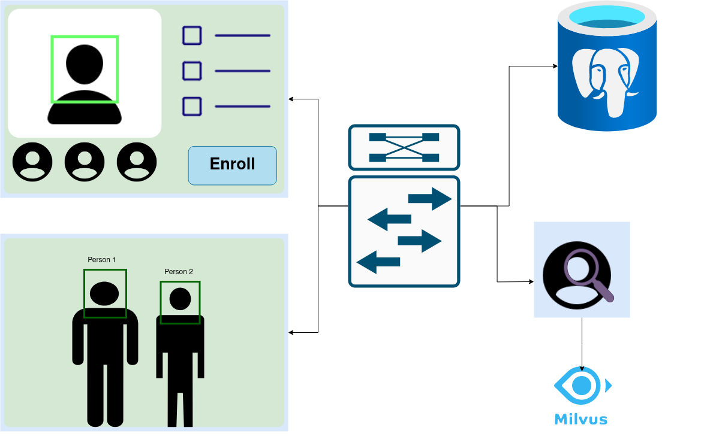

# SimpleFaceDetector

Installation:

1. Install Middleware

    $ cd ./SimpleMiddleware
    $ python3.8 -m pip install -r requiements.txt 

    ! Some of the requirement may not be included

2. Install FR Server

    a. Install Face recongnizer

    $ cd ./FRserver/FaceRecognizer
    $ docker-compose up --build

    b. Install Milvus server

    $ cd ./FRserver/Milvus
    $ mkdir db
    $ mkdir logs
    $ mkdir wal
    $ docker-compose up --build

3. Install FaceDetector

    $ cd FaceDetector
    $ python3.8 -m pip install -r requiements.txt 

4. Install Enrollment
    
    $ cd Enrollment
    $ python3.8 -m pip install -r requiements.txt 

Run:

1. Middleware
    
    $ cd SimpleMiddleware
    $ python3 main.py

2. FR Server

    $ cd FRserver

    a. Face recognizer
    
    $ cd Face recognizer
    $ docker-compose up

    b. Milvus server

    $ cd Milvus
    $ docker-compose up

3. Face Detector
    
    $ cd FaceDetector
    $ python3 main.py

4. Enroller
    
    $ cd Enrollment
    $ python3 main.py 